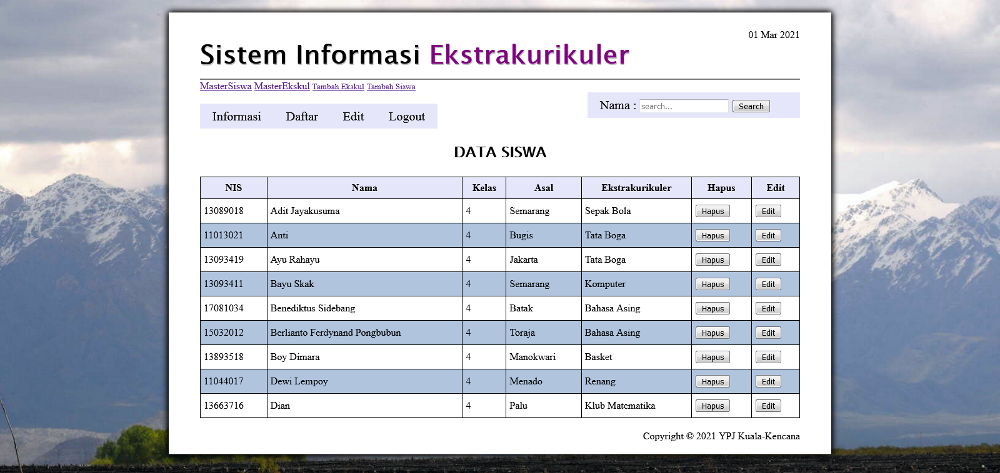

# daftar-ekskul

## :triangular_flag_on_post: Table of Contents
1. _[About The Project](#about-the-project)_
2. _[Features](#features)_
3. _[Built With](#built-with)_
4. _[Requirements](#requirements)_
5. _[Installation](#installation)_
6. _[Launch](#launch)_

## About The Project
Applications that can help teachers in registering students into extracurricular activities.

**Overview** :rainbow:

  

## Features 
- Add **new students:**
- View **list of school's students**
- Add **new extracurricular** activities
- View **school's extracurricular** list
- See which **students** are taking a **particular extracurricular** activity
- **Add students** to **extracurricular** activities they want
- **Edit and delete students** in **extracurricular** activities

## Built With 
**Technologies:**
- HTML
- CSS
- PHP
- AJAX

**Tools:**
- [XAMPP](https://www.apachefriends.org/index.html "download xampp") - _For creating our server and database_
- Notepad++

## Requirements
- Install xampp
- Web Browser supporting HTML5 : Google Chrome / Firefox

## Installation 
- Download and Install [XAMPP](https://www.apachefriends.org/index.html "download xampp")

## Launch 
- Open XAMPP Control panel and start **[apache]** and **[mysql]**
- Download project's Zip
- Extract
- Cut the project folder to \xampp\htdocs
- http://localhost/daftar-ekskul-master/buat_db_tabel.php 👉 to create database and its initial data
- http://localhost/daftar-ekskul-master/index.php 👉 run app

> 🧷 **Note**  
◾ **koneksi.php** untuk config database 
◾ **buat_db_tabel.php** untuk script pembuatan tabel
