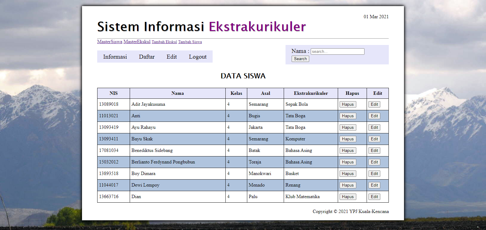

# daftar-ekskul

## :triangular_flag_on_post: Table of Contents
1. _[About The Project](#about-the-project)_
2. _[Features](#features)_
3. _[Screenshot](#screenshot)_
4. _[Built With](#built-with)_
5. _[Requirements](#requirements)_
6. _[Installation](#installation)_
7. _[Launch](#launch)_

## About The Project
**Overview** :rainbow:

  

## Features 
## Built With 
## Requirements 
## Installation 
## Launch 
